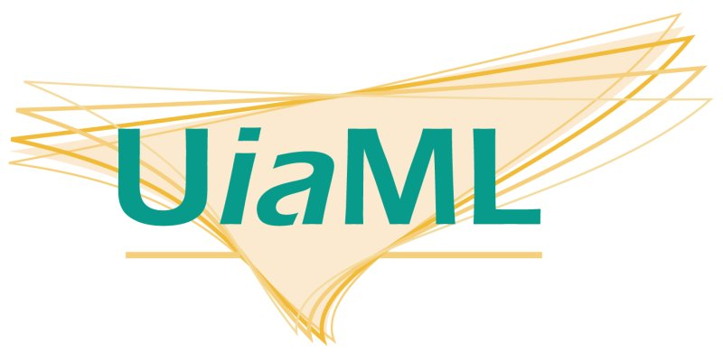

= U__ia__ML

[frame=none, grid=none]
|===
|The **U**niversal __**i**nformation **a**rchitecture__ **M**odeling **L**anguage (U__ia__ML) should help to model and document application front ends. a|  
|===

Around the year 2000 Louis Rosenfeld and Peter Morville published the book "Information Architecture for the world wide web" and introduced Sitemaps and Wireframes as common deliverables of an Information Architect (ia). +
However these models haven't been standardized, and couldn't keep up with the dynamic development of the web. Therefore sitemaps that model the navigation of the site to be developed are as good as dead, and wireframes are only screenshots of a site to be build and needs lots of unstructured information in order to communicate them to the stakeholders. +

U__ia__ML is a modeling language that tries to offer a way to be able to model your sitemaps again and to design the content of a site in a more structured manner. U__ia__ML is however not a replacement for the wireframes but rather a foundation of which you could derive wireframes.

* link:specification/README.adoc[U__ia__ML specification]
* link:tutorial/drop-shop-case/README.adoc[U__ia__ML tutorial]
