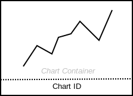

= Chart

== Symbol

== Symbol Properties

[options=header]
|===
| Property | Type | Description
| Chart Id | String | Unique identifier of the chart within the contentarea.
| Chart | Sketch | Further research of this U__ia__ML element is required to determine whether a sketch of the intended charttype is a better way to model this element, than a fixed charttype symbol.
|===

== Documentation Properties

[options=header]
|===
| Property | Type | Description
| Chart Id | U__ia__ML path | The Chart Id part of the U__ia__ML path has to be identical to the one used by the Symbol Property.
| Intended Content | String | Description of what the chart is intended to show.
|===

== Explanation
The Chart element is a contentarea element (CAE) that represents a chart. The chart container can hold other CAE's. Placing CAE's into the container indicates that the CAE's are meant to be grouped together.