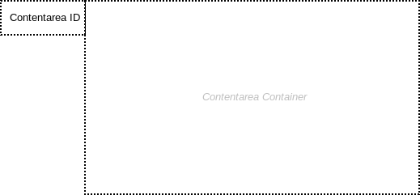

= Contentarea

== Symbol

== Symbol Properties

[options=header]
|===
| Property | Type | Description 
| Contentarea Id | String | This Id must correspond to a link:../../smd/smd-contentarea/README.adoc[Contentarea Id] of the Sitemap Diagram (SMD).
|===

== Documentation Properties

[options=header]
|===
| Property | Type | Description 
| - | - | - 
|===

== Explanation
In the Contentarea Diagram (CAD) the contentarea symbol offers a container for contentarea elements (CAE). The Contentarea Id must correspond to a link:../../smd/smd-contentarea/README.adoc[Contentarea Id] within the Sitemap Diagram (SMD).
