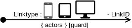

= Link

== Symbol

== Symbol Properties

[options=header]
|===
| Property | Type | Description
| Link type | "L" \|"E" | Whether the link is triggered by a __“click”__ from the user (in this case the indication “L” is optional) or by an event (“E”).
| Link Id | String | A string that corresponds to the link:../../smd/smd-link/README.adoc[Link Id] of the outgoing links of this contentarea as modelled within the Sitemap Diagram (SMD).
|===

== Documentation Properties

[options=header]
|===
| Property | Type | Description
| - | - | -
|===

== Explanation
The Link Id's used within the CAD must match those used within the SMD. Within the CAD the link source of a normal link (link type “L”) must be a CAE, indicated by placing the start point of the link within the CAE that triggers the link. The link destination is pointing somewhere outside the link:../cad-contentarea/README.adoc[contentarea element].
In case the link is an event link, the start point of the link is the frame of the contentarea element itself.
Within the CAD there may be more than one link with the same Link Id. They however represent a single link with the same Link Id in the SMD.
