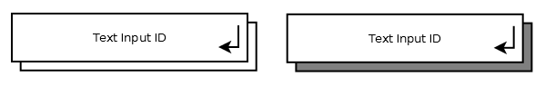

= Text Input

== Symbol

== Symbol Properties

[options=header]
|===
| Property | Type | Description
| Text Input Id | String | Unique identifier within the contentarea.
| Mandatory | Shadow | Visible indicates whether or not the input field is mandatory (dark shadow) or not (white shadow).
|===

== Documentation Properties

[options=header]
|===
| Property | Type | Description
| Text Input Id | U*ia*ML path | The Text Input Id part of the U__ia__ML path has to be identical to the one used by the Symbol Property.
| Intended Content | String | Description of the default text (not the actual text itself) that should be placed within the input field.
| Intended Purpose | String | Description that explains the reason of asking for this value.
|===

== Explanation

- 