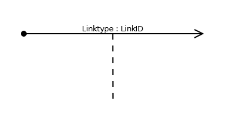

= Associated Link

== Symbol

== Symbol Properties

[options=header]
|===
Property | Type | Description
| Linktype | "L" \| "E" | Whether the link is triggered by a _“click”_ from the user (in this case the indication “L” is optional) or by an event (“E”). 
| Link Id | String | A string that uniquely identifies the link in perspective of the contentarea the link originates from.
|===

== Documentation Properties

[options=header]
|===
| Property | Type | Description
| Link Id | U__ia__ML path | Only required in case the trigger property will be described as well. +
 The path must identify the link symbol used within the diagram. 
| Trigger | String | In case the link is an event link, a description of what triggers the event is required.
|===

== Explanation
Like the common link the associated link is a link between a link:../smd-contentarea/README.adoc[contentarea] and a link:../smd-page/README.adoc[page]. The difference with the link:../smd-link/README.adoc[common link] is that the transition also triggers the content related to the associated link. This content is either visible but not visible within the current link:../smd-sitemap/README.adoc[Sitemap], or offer the content to another system. That content is indicated by the dashed line, and the content is modeled outside the current link:../smd-sitemap/README.adoc[Sitemap symbol] in order to show that is not something the user sees within the active content window.

Typical examples of such visible content related activities are link:../smd-popup/README.adoc[popups], with triggers another link:../smd-sitemap/README.adoc[sitemap] of the project we are modelling or the opening of a third party application like a mail client.
Writing the content on a file (for instance a .docx, .pdf or .xml) so that the file can be used by another system is an example of a non visible content related activity. +
Storing the content in a database is most of the time a system internal process, because the stored content is not meant to be leaving the project we are modeling via direct database access from a different system.
