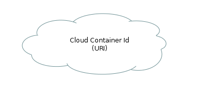

= Cloud

== Symbol

== Symbol Properties

[options=header]
|===
| Property | Type | Description
| Cloud Container Id | String | optional id to identify the cloud and its expected content
| URI | String | In case that cloud represents a static URI of an external site, the URI can be given within the symbol.
|===

== Documentation Properties

[options=header]
|===
| Property | Type | Description
| - | - | - 
|===

== Explanation

The cloud symbol is used for two situations:

* Nondeterministic links: Unfortunately not all sitemaps are deterministic. There might always be links to pages that can not be predicted. Take for instance the resultset of a search query that refers to several pages. The page that holds the search results can be modeled using U__ia__ML, but because we don’t know which search results will be shown the pages the search result points to can not be modelled from the search result page.
In this situation we can name the cloud by adding a representatief Cloud Container ID to the symbol, but it’s required. Also there is no need to document any property.

* A static link toward a page outside the scope of our model. In this case the URI of the page will be known, but the design of that page is out of our scope. The URI of the external page should be added to the cloud symbol itself.
