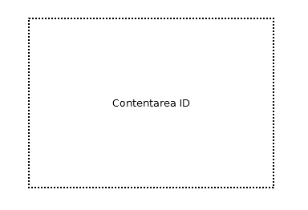

= Contentarea

== Symbol

== Symbol Properties

[options=header]
|===
| Property | Type | Description
| Contentarea Id | String | Unique name within the site project for each content grouping.
|===

== Documentation Properties

[options=header]
|===
| Property | Type | Description
| Contentarea Id | U__ia__ML path | The Contentarea Id part of the U__ia__ML path has to be identical to the one used by the Symbol property.
| Description | String | Text that describes the information that will be represented by this contentarea.
|===

== Explanation
A contentarea is the container that hold several contentarea elements (CAE), like text, images or input fields. There are no hard rules about the boundaries of a contentarea, but often a deployed contentarea is recognizable by a different background or a frame that groups the content.

A contentarea might reappear on several different pages within a single site. The menu is an example of such a contentarea.
Within a U__ia__ML Sitemap there is for each contentarea with the same contentarea Id exactly one contentarea symbol in which the contentarea Id is underlined. This is the defining contentarea. Only from that link:../smd-link/README.adoc[contentarea] to other link:../smd-page/README.adoc[pages] may be drawn.
