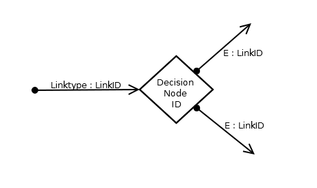

= Decision Node

== Symbol

== Symbol Properties

[options=header]
|===
| Property | Type | Description
| Decision Node Id | String | String that uniquely identifies the decision node within a single sitemap.
|===

== Documentation Properties

[options=header]
|===
| Property | Type | Description
| Decision Node Id | U__ia__ML path | The Decision Node Id part of the U__ia__ML path has to be identical to the one used by the Symbol Property.
| Decision description | String | Textual explanation of the choice and where the decision about which outgoing link to be followed will be based on.
| Internal Decision base | Array of U__ia__ML paths | List of Contentarea Elements (CAE) that serve as input for the decision to be made.
| External Decision base | Array of Strings | List of external factors that are required to make the decision at hand.
|===

== Explanation

The decision element enables us to model dynamic site navigation. It requires exactly one incoming link:../smd-link/README.adoc[link] and has two or more outgoing link:../smd-link/README.adoc[links]. Due to the fact that outgoing links aren't triggered by the user themselves the link types of outgoing links is that of an event link.

The decision description must result in the deterministic choice of exactly one outgoing link to be followed. The choice has to be based on information listed by the internal and external decision bases property.

By specifying the decision bases one can verify that the information needed to make the decision indeed is available within the system. Specifying the decision bases is also an important way of communicating the design with developers.

In the properties to be documented a difference is made between internal and external decision bases.

An internal decision base is a Contentarea Element (CAE), like a link:../../cad-text-input/README.adoc[Text Input] or a link:../../cad/cad-list/README.adoc[Selection List], specified by a Contentarea Diagram (CAD) that is part of the site that is modelled. 
The CAE is to be referred by U__ia__ML path that uniquely identifies the CAE, starting at the SMD sitemap id and separating each level with a dot (‘.’).

An external decision base is an information source outside of the site to be modelled, like for instance the current time, date or the available disk space. But it can also be the result of an inquiry of an external system based on an internal decision base. For example the balance of a customer that can be retrieved from a Financial System (this is a given system that our site can communicate with), given the customer id as specified by an CAE of the site to be modeled.

Data stored by the site we model is never to be used as an external decision base within our model. In case we want to use this data as decision base, than we have to find the CAE that was used to accumulate the data we stored and use that CAE as internal decision base.
