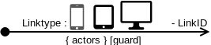

:icons: font 
ifdef::env-github[]
:tip-caption: :bulb:
:note-caption: :information_source:
:important-caption: :heavy_exclamation_mark:
:caution-caption: :fire:
:warning-caption: :warning:
endif::[]
= Link

== Symbol

== Symbol Properties

[options=header]
|===
| Property | Type | Description
| Link type | "L" \| "E" | Whether the link is triggered by a __“click”__ from the user (in this case the indication “L” is optional) or by an event (“E”).
| Link Id | [device indicator - ] String | The device indicator part is optional and can be a string or a symbol followed by a dash to seperate the device indicator from the string. The device indicator specifies for which devices this link is valid (for instance smartphone, tablet or desktop).
Together with the string part the Link Id uniquely identifies the link in perspective of the contentarea the link originates from.
| { actors } | List of Strings | Optional property that defines which actor has the right to trigger this link.
NOTE: In case the link:../smd-sitemap/README.adoc[sitemap] contains an actor indication all links within that sitemap inherit the actors from the sitemap property even if the actors are not listed at this link property.
| [guard] | Boolean expression based on keys | Optional property that can be used to determine whether the link is enabled or disabled based on keys given by the internal and/or external decision base. 
|===

== Documentation Properties

[options=header]
|===
| Property | Type | Description
| Link Id | U__ia__ML path | Only required in case the trigger property will be described as well. +
The Link Id part of the U__ia__ML path has to be identical to the one used by the Symbol Property. 
| Trigger | String | In case the link is an event link, a description of what triggers the event is required.
| Internal Decision base | list of key-value pairs of U__ia__ML paths | In case the optional guard is used, the keys value refer to the Contentarea Elements (CAE) that are used to make the decision.
| External Decision base | list of key-value pairs | In case the optional guard is used, the keys value refers to external factors that are required to make the decision.
|===

== Explanation
Links are the key elements of a link:../smd-sitemap/README.adoc[sitemap]. They provide navigational paths between the different sitemap elements (SME). There are however some restrictions to a link:

* A normal “clickable” link starts within a link:../smd-contentarea/README.adoc[contentarea] that holds a Contentarea Element (CAE) by which a user can trigger the link and points toward the link:../smd-page/README.adoc[page] that will be shown next.

* Event links are generated by either the result of a link:../smd-decision-node/README.adoc[Decision Node], a system trigger like a timer or by a user generated system trigger generated outside of the link:../smd-sitemap/README.adoc[sitemap] like clicking on the close window button.
In case of a system trigger the documentation requires that the trigger will be described.
The starting point of an event link is either a link:../smd-contentarea/README.adoc[contentarea], a link:../smd-decision-node/README.adoc[Decision Node] or the frame of the link:../smd-sitemap/README.adoc[sitemap].
