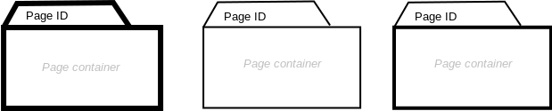

= Page

== Symbol

== Symbol Properties

[options=header]
|===
| Property | Type | Description
| Page Id | String | Must be an unique identifier to differentiate all pages within a single sitemap.
| Start page | All Lines bold  | Each project should have at exactly one start page that will be shown on starting the application e.g. opening the site. In U__ia__ML a start page is indicated by a bold frame.
| Landing page | Only container lines are bold | Additional landing pages other than the start page are not required, but in to destinguish them from the other pages their container part should have a bolder line width.
|===

== Documentation Properties

[options=header]
|===
| Property | Type | Description
| Page Id | U__ia__ML path | The Page ID part of the U__ia__ML path has to be identical to the one used by the Symbol Property.
| Start page | Boolean | True in case the page will be the standard page to be shown on starting the application / opening the site.
| Landing page | Boolean | A Landing Page is not the default starting page, but it is a starting page the user derives by either a special URL (in case of a web site) or some parameters given with the startup.
|===

== Explanation
A Page is the container of a number of contentareas (see: link:../smd-contentarea/README.adoc[SMD - Contentarea Element] ). The page container can hold any number of content areas.
A Page is not a physical representation of a file, like default.html or article.php. In U__ia__ML a Page represents what the user experience as a page.
