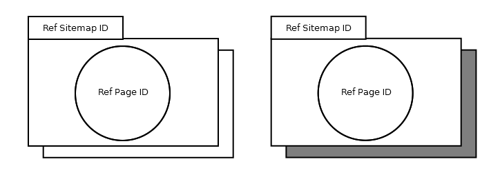

= Popup

== Symbol

== Symbol Properties

[options=header]
|===
| Property | Type | Descriptionn|
| Ref Sitemap Id | String | Refers to the sitemap that represents the popup. This property must correspond with a link:../smd-sitemap/README.adoc[Sitemap Id] within the same project. |
| Ref Page Id | String | Name of the link:../smd-page/README.adoc[Page Id] to be shown. The Page ID must correspond with a link:../smd-page/README.adoc[Page Id] of the link:../smd-sitemap/README.adoc[Ref Sitemap Id]. |
| Mandatory | Shadow | Indicates whether or not the referred sitemap will hold the focus until it is closed (indicated by a dark shadow) or that the user can still navigate within the sitemap that triggered the popup, even when the popup hasn’t been closed yet (indicated by a white shadow). |
|===

== Documentation Properties

[options=header]
|===
| Property | Type | Descriptionn|
| - | - | - |
|===

== Explanation
The popup symbol represents that another application window. The popup may only be invoked by an link:../smd-associated-link/README.adoc[associative link] and has to be drawn outside of the invoking link:../smd-sitemap/README.adoc[sitemap symbol]. 
A sitemap may hold several popups with the same Ref Sitemap Id. Several popups with the same Ref Sitemap Id also refer to the same physical application window.
Opening a popup with the same Ref Sitemap Id than an already opened popup should not open another popup, but should replace the content of the already open popup window with the content of the newly opened popup.
