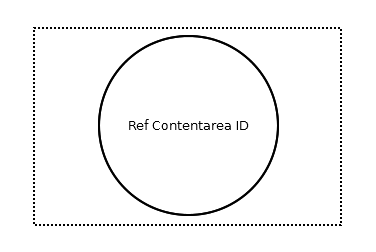

= Reference Contentarea Connector

== Symbol

== Symbol Properties

[options=header]
|===
| Property | Type | Description
| Ref Contentarea Id | String | Name of the contentarea that is the source of this reference.
|===

== Documentation Properties

[options=header]
|===
| Property | Type | Description
| - | - | -
|===

== Explanation

The Reference Contentarea Connector is only meant to be used in combination with the link:../smd-reference-page-connector/README.adoc[Reference Page Connector]. The Reference Contentarea Connector is part of a toolset to maintain the overview of models of a larger link:../smd-sitemap/README.adoc[sitemap].
Using the Reference Connector toolset, a single link:../smd-sitemap/README.adoc[sitemap] can split up into several sitemap diagrams.
