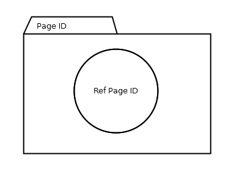

= Reference Page Connector

== Symbol

== Symbol Properties

[options=header]
|===
| Property | Type | Description
| Ref Page Id | String | Name of the page that is the target of this reference.
|===

== Documentation Properties

[options=header]
|===
| Property | Type | Description
| - | - | -
|===

== Explanation

The Reference Page Connector is only meant to be used in combination with the link:../smd-reference-contentarea-connector/README.adoc[Reference Contentarea Connector]. The Reference Page Connector is part of a toolset to maintain the overview of models of a larger link:../smd-sitemap/README.adoc[sitemap].
Using the Reference Connector toolset, a single link:../smd-sitemap/README.adoc[sitemap diagram] can split up into several sitemap diagrams.
