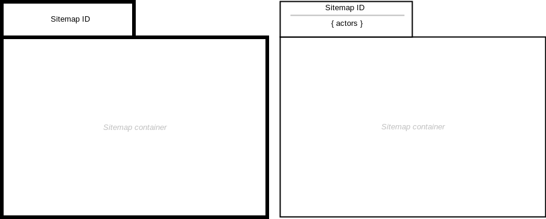

= Sitemap

== Symbol

== Symbol Properties

[options=header]
|===
| Property | Type | Descriptionn|
| Sitemap Id | String | Unique id for each sitemap within a single project. |
|===

== Documentation Properties

[options=header]
|===
| Property | Type | Descriptionn|
| - | - | - |
|===

== Explanation

The Sitemap represents a single application window and the boundaries of the site we want to model.
The sitemap container can hold any kind of sitemap elements (SME), except link:../smd-popup/README.adoc[popup elements] which have their application window and therefore a different sitemap. Their symbol are therefore draw outside of the sitemap symbol, but connected via an link:../smd-associated-link/README.adoc[associated link] with the a link within the sitemap.

In case that the sitemap gets to crowded, a new empty sitemap can be drawn which must have the same Sitemap Id to express that the two sitemaps represents the same application window and therefore representing a single sitemap. By using Reference Connector (see: link:../smd-reference-contentarea-connector/README.adoc[Reference Contentarea Connector] resp. link:../smd-reference-page-connector/README.adoc[Reference Page Connector]) navigation between these two sitemap drawings can be modelled.
