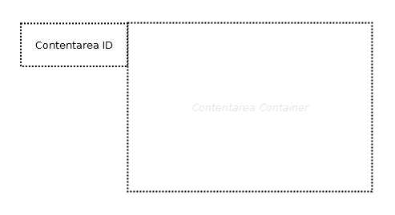

# Contentarea

## Symbol

## Symbol Properties

| Property | Type | Descriptionn|
|:----------:|:------:|-------------|
| Contentarea Id | String | This Id must correspond to a [Contentarea Id](../../smd/smd-contentarea/README.md) of the Sitemap Diagram (SMD).

## Documentation Properties
| Property | Type | Descriptionn|
|:----------:|:------:|-------------|
| - | - | - |

## Explanation
In the Contentarea Diagram (CAD) the contentarea symbol offers a container for contentarea elements (CAE). The Contentarea Id must correspond to a [Contentarea Id](../../smd/smd-contentarea/README.md) within the Sitemap Diagram (SMD).