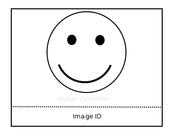

# Image

## Symbol

## Symbol Properties

| Property | Type | Descriptionn|
|:----------:|:------:|-------------|
| Image Id | String | Unique identifier of the image within the contentarea. |
| Smiley | Sketch | Further research of this U*ia*ML element is required to determine whether a simple smiley is sufficient or that a sketch of the intended image would be a better way to model this element. |

## Documentation Properties
| Property | Type | Descriptionn|
|:----------:|:------:|-------------|
| Image Id | U*ia*ML path | The Image Id part of the U*ia*ML path has to be identical to the one used by the Symbol Property. |
| Intended Content | String | Description of what the image is intended to show. |

## Explanation
The Image element is a contentarea element (CAE) that represents a image. The image container can hold other CAE's. Placing CAE's into the container indicates that the CAE's are meant to be grouped together.