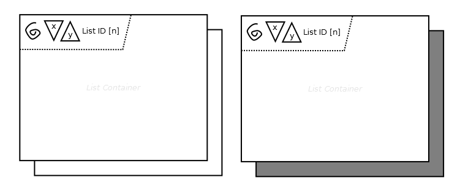

# List

## Symbol

## Symbol Properties

| Property | Type | Descriptionn|
|:----------:|:------:|-------------|
| List Id | String | Unique identifier within the contentarea. |
| n | Integer \| 'n' | Number of items listed, either a integer or the letter ‘n’ in case the number of items is not fixed. |
| x | Integer | Minimum number of list entries that has to be selected by the user. |
| y | Integer \| 'n' | Maximum number of list entries that may be selected by the user. In case the number is not fixed the letter ‘n’ may be used. |
| Recursion | drawn / not drawn | Spiral symbol, that when drawn expresses that the list is recursief. |
| Mandatory | Shadow | Visible indicates whether or not the list is mandatory (dark shadow and the property x has a value greater than zero) or not (white shadow and the property x has a value equal to zero). |

## Documentation Properties
| Property | Type | Descriptionn|
|:----------:|:------:|-------------|
| List Id | U*ia*ML path | The List Id part of the U*ia*ML path has to be identical to the one used by the Symbol Property. |
| Sort Element | CAE list | List of Contentarea Elements (CAE) within the List container in preceding order by which the list is sorted by default. |
| Sort Order | String | Organization schemes of the Sort Elements, like alphabetically ordered ascending / descending, Chronological, Geographical, ... |
| Recursion | String | Only required in case the list is recursief.
Explanation which CAE of the List Container will trigger the recursion. |

## Explanation
All Contentarea Elements (CAE) within the List container represent a single list entry. This means that the List Container must hold at least one CAE. 
The List elements symbol represents a list of these list entries.
In case the List symbol property ‘y’ has a value greater than zero a list entry can be selected and therefore must have a [link](../cad-link/README.md) associated to it, that starts at the List Container.

The list is recursief, when there are list entries that will trigger the list to be redrawn with new content, without changing the CAE’s within the List Container. 
An example of such a recursive list is a file explorer. One of the list entries of the file explorer might be a folder, that when selected will trigger the list to be redrawn with new content, without changing the CAE’s within the List Container.
