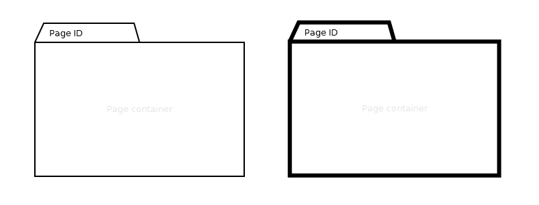

# Page

## Symbol

## Symbol Properties

| Property | Type | Descriptionn|
|:----------:|:------:|-------------|
| Page Id | String | Must be an unique identifier to differentiate all pages within a single sitemap. |
| Startpage | Line width | Each project should have at least one start page that will be shown on starting the application e.g. opening the site. In UiaML a start page is indicated by a bold frame. |

## Documentation Properties
| Property | Type | Descriptionn|
|:----------:|:------:|-------------|
| Page Id | U*ia*ML path | The Page ID part of the U*ia*ML path has to be identical to the one used by the Symbol Property. |
| Startpage | Boolean | True in case the page will be the standard page to be shown on starting the application / opening the site. |
| Landingpage | Boolean | A Landing Page is not the default starting page, but it is a starting page the user derives by either a special URL (in case of a web site) or some parameters given with the startup. |

## Explanation
A Page is the container of a number of contentareas (see: [SMD - Contentarea Element](../smd-contentarea/README.md) ). The page container can hold any number of content areas.
A Page is not a physical representation of a file, like default.html or artikel.php. In U*ia*ML a Page represents what the user experience as a page.