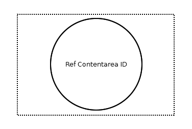

# Reference Contentarea Connector

## Symbol

## Symbol Properties

| Property | Type | Descriptionn|
|:----------:|:------:|-------------|
| Ref Contentarea Id | String | Name of the contentarea that is the source of this reference. |

## Documentation Properties
| Property | Type | Descriptionn|
|:----------:|:------:|-------------|
| - | - | - |

## Explanation
The Reference Contentarea Connector is only meant to be used in combination with the [Reference Page Connector](../smd-reference-page-connector/README.md). The Reference Contentarea Connector is part of a toolset to maintain the overview of models of a larger [sitemap](../smd-sitemap/README.md).
Using the Reference Connector toolset, a single [sitemap diagram](../smd-sitemap/README.md) can split up into several sitemap diagrams.
