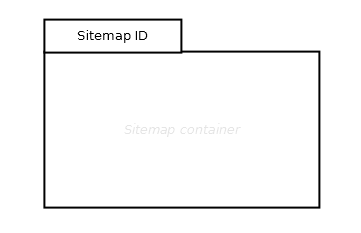

# Sitemap

## Symbol

## Symbol Properties

| Property | Type | Descriptionn|
|:----------:|:------:|-------------|
| Sitemap Id | String | Unique id for each sitemap within a single project. |

## Documentation Properties
| Property | Type | Descriptionn|
|:----------:|:------:|-------------|
| - | - | - |

## Explanation
The Sitemap represents a single application window and the boundaries of the site we want to model.
The sitemap container can hold any kind of sitemap elements (SME), except [popup elements](../smd-popup/README.md) which have their application window and therefore a different sitemap. Their symbol are therefore draw outside of the sitemap symbol, but connected via an [associated link](../smd-associated-link/README.md) with the a link within the sitemap.

In case that the sitemap gets to crowded, a new empty sitemap can be drawn which must have the same Sitemap Id to express that the two sitemaps represents the same application window and therefore representing a single sitemap. By using Reference Connector (see: [Reference Contentarea Connector](../smd-reference-contentarea-connector/README.md) resp. [Reference Page Connector](../smd-reference-page-connector/README.md)) navigation between these two sitemap drawings can be modelled.