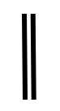

# Terminator

## Symbol

## Symbol Properties

| Property | Type | Descriptionn|
|:----------:|:------:|-------------|
| - | - | - |

## Documentation Properties
| Property | Type | Descriptionn|
|:----------:|:------:|-------------|
| - | - | - |

## Explanation
The terminator symbol represents the termination of an application window. Within the sitemap of a [mandatory popup](../smd-popup/README.md) window a [link](../smd-link/README.md) toward this symbol is commonly used to close the popup and return the focus to the window that opened the popup. 
Closing a window using the default closing options offered by the operating system can be modeled by an event link from the frame of the [sitemap](../smd-sitemap/README.md) toward the terminator symbol. But this is normally not modeled since this is the default behavior inherited from the operating system. By explicitly modeling this the default behavior might be overwritten.
