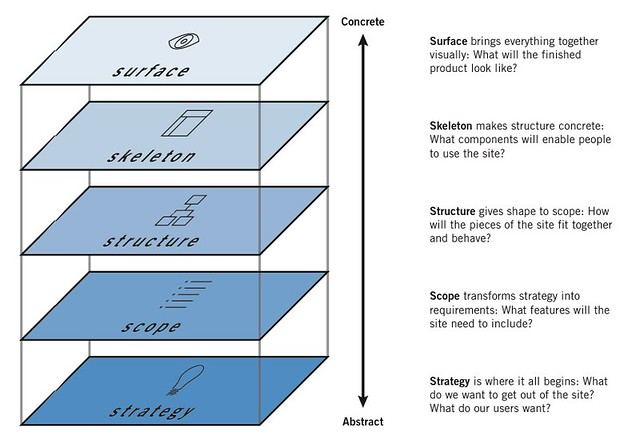

= The Drop Shop Case Tutorial
:icons: font
ifdef::env-github[]
:tip-caption: :bulb:
:note-caption: :information_source:
:important-caption: :heavy_exclamation_mark:
:caution-caption: :fire:
:warning-caption: :warning:
endif::[]

This U__ia__ML tutorial will use the framework of link:http://www.jjg.net/elements/["The Elements of User Experience" by Jesse James Garrett] to approach the fictional case "The Drop Shop"

.The Element of User Experience  link:https://www.flickr.com/photos/caseorganic/4711059250[]

"Drop" is the dutch word for liqurorice, and is one of the most favorite sweets of the Dutch which therefore comes in lots of varieties.
"The Drop Shop" is a fictional sweets store that is specialized in 'drop'. +
In this case the shop owner wants a website to promote his shop. But because it's a small shop we will start with a very simple site. That we will refer to as version 1.

link:./version-1/README.adoc[Version 1 - Tutorial]

// Version-2: add dynamically maintain the assortment -> Use cases add, delete and modify sweet -> UiaML forms, rights, landingpage (login for owner)-> reference pages...

// Version-3: add order use case -> popup, assosiated pages (mail)