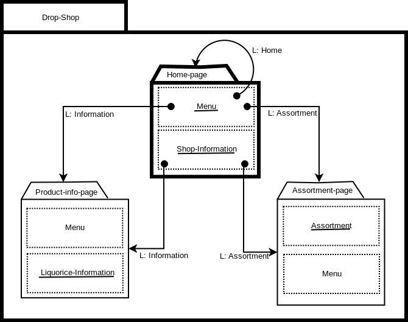
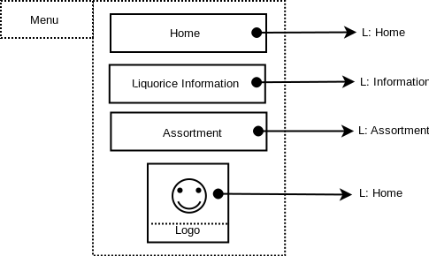
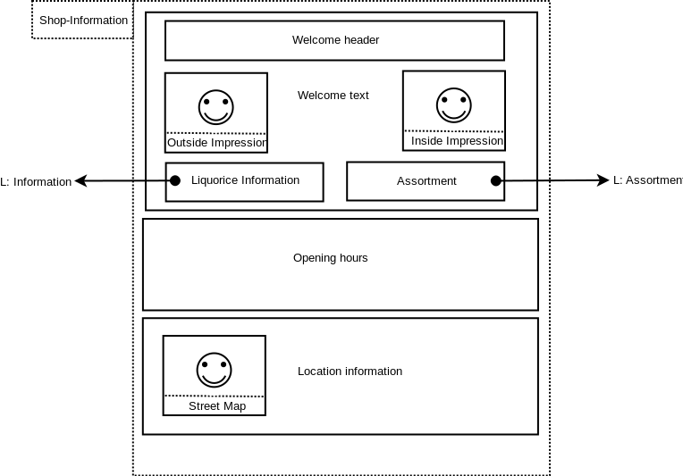
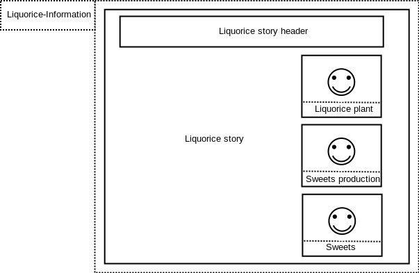
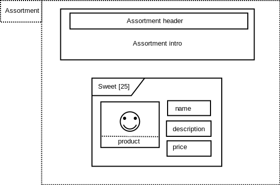

= The Drop Shop: Design Specification (Version 1)
:Author: Alex Jongman
The Drop Shop - Tutorial Part 1 - Design Specification
:sectnums:
:toc:
:icons: font
ifdef::env-github[]
:tip-caption: :bulb:
:note-caption: :information_source:
:important-caption: :heavy_exclamation_mark:
:caution-caption: :fire:
:warning-caption: :warning:
endif::[]

This is the design document for the first version of the Drop Shop site.

=== Strategy Layer
The strategy layer will provide information about the Business Case and the Personas of the Drop Shop.

==== Business Case
The site to be build should provide some basic information for customers so that visitors of the site know what the shop is about, where to find it and when the shop is open for business. The shop owner also wants to distinguish himself from other sweets shop by showing that this shop really knows it's products.

==== Personas

* **Ilse**: A child of 11 years old who really likes all kinds of sweets especially when they are colorful.
* **Jaap**: A business man who often travels and always wants to have some 'drop' with him. He always is interested in new kinds of 'drop' and the story behind it.

=== Scope Layer
The scope layer describes the static and dynamic functionality of the site to be build, expressed by Use Cases and User Stories.

==== UML Use Cases
There are no UML Use Cases in this version of the Drop Shop.

==== User Stories

. As a customer I want to know where the shop is located and how it looks in order to determine if I want to travel to it.
. As a customer I want to know when the shop is open
. As a customer I want to see what kinds of sweets the shop provides.
. As the business owner I want to distinguish the shop from other sweets sellers by showing that the shop really is specialized in sweets and can provide information normally not available at other stores.

=== The Structure layer
In this chapter the model of the sitemap to be realised will be given.

.The U__ia__ML Sitemap

.Contentarea documentation with ux-decision extension
[%autowidth, cols="3*a", options=header]
|===
| Contentarea ID | Description | ux-extension

| Menu | A navigational menu to access all pages of the site  | 
[%autowidth, cols=3]
!===
! Ilse
! priority 4
! The menu doesn't contain the content that she wants to see on the site, but it is a contentarea she expect to be part of the site.

! Jaap
! priority 4 
! The menu doesn't contain the content that he wants to see on the site, but it is a contentarea he expect to be part of the site.
!===

| Shop-Information | Information about the location of the shop, some inside- and outside images of the store to give an impression of the store and a information about the opening hours.
This contentarea therefore fulfills the requirements of the first and second user story. | 
[%autowidth, cols=3]
!===
! Ilse
! priority 8
! She knows the store very well, therefore the location is known to her, but often forgets the opening hours of the store.

! Jaap
! priority 9 
! Based on the impressions of the store he determines whether to buy his sweets at the nearest supermarket or at this specialized store. This information about the location and opening hours is very important to him because he travels often by car and has to determine the route to the shop and if he will make it in time after work before the shop closes. 
!===
| Liquorice-Information | A story combined with some images about the liquorice plant and the history of sweets in general. 
This content area will be be the realization of the forth user story. |
[%autowidth, cols=3]
!===
! Ilse
! priority 1 
! For her this information is boring, only the image of the liquorice plant might get her attention.

! Jaap
! priority 5 
! For him this information is nice to know and might be useful in a conversation with foreigners who aren't familiar with this dutch treat. It also gives him some insurance that the store knows its sweets.
!===
| Assortment | A static overview of some sweets sold at the store (the third user story). |
[%autowidth, cols=3]
!===
! Ilse
! priority 8
! She likes to look at the sweats, especially when they are colorful. It gives her ideas of what to buy next.

! Jaap
! priority 6
! It gives him a good impression of what the store has to offer, but he would prefer a more complete overview and online store.
!===
|===

.page documentation
[options=header]
|===
| Page ID | Startpage | LandingPage
| Home-page | yes | no
| Product-info-page | no | no
| Assortment-page | no | no
|===

=== The Skeleton Layer
Now that the contentareas are determined by the sitemap, the specification of each contentarea can be given.

==== Menu contentarea

.The Menu Contentarea

.image documentation with content specification extension
[%autowidth, cols="4*a", options=header]
|===
| Image ID | Intended content | type | URI
| Logo | A company logo that by clicking will navigate the user to the home page. | static | "D:\images\DropShopLogo.png"
|===

.text label documentation
[%autowidth, cols="3*a", options=header]
|===
| Text label | Intended content | type
| Home | Text label to indicate that by activating this label the user will be navigated to the home page. | static
| Liquorice Information | Text label to indicate that by activating this label the user will navigate to the Liquorice Information page. | static
| Assortment | Text label to indicate that by activating this label the user will navigate to the Assortment page. | static
|===

.text label documentation, content specification
[%autowidth, options="header"]
|===
| Text label | Language | Content
| Home | NL | "Home"
| Liquorice Information | NL | "Meer over drop"
| Assortment | NL | "Ons assortiment"
|===

==== Shop-Inforamtion Contentarea

.The Shop-Information Contentarea

.image documentation
[%autowidth, cols="2*a", options=header]
|===
| Image ID | Intended content 
| Outside Impression | An image that shows the shop from the outside, so that visitors can easily recognize the shop.
| Inside Impression | An image of the inside of the shop to give the impression that it's a nice clean shop, where the stocks are filled and their is plenty of sweets to choose from.
| Street Map | A simple street map that has a marker that shows the location of the shop.
|===

.text label documentation
[%autowidth, cols="3*a", options=header]
|===
| Text label | Intended content | type
| Welcome header | A welcome slogan 
| Welcome text | A very short text about the shop that explains what this site is about, what the user can find here and why the user should shop here and not somewhere else.
| Liquorice information | part of the welcome text element that links to the Liquorice-Information-page.
| Assortment | part of the welcome text element that links to the Assortment-page.
| Opening hours | A table with the opening hours of the shop.
| Location information | The address of the shop as well as information about the nearest public transport stop and about parking.
|===

==== Liquorice-Information Contentarea

.The Liquorice-Information Contentarea

.text label documentation
[%autowidth, cols="2*a", options=header]
|===
| Text label | Intended content 
| Liquorice story header | A short header of the liquorice story
| Liquorice story | A story about liquorice, which should contain a little bit about the history of sweets, the liquorice plant itself, the production of sweets and the current state of sweets in general.
|===

.image documentation
[%autowidth, cols="2*a", options=header]
|===
| Image ID | Intended content 
| Liquorice plant | An image that combines a drawing and photo of the liquorice plant.
| Sweets production | A photo of the sweets production, preferable in a kitchen setting to show the handmade products that this shop also offers.
| Sweets | The handmade final product.
|===

==== Assortment Contentarea

.The Assortment Contentarea

.List documentation
[%autowidth, cols="4*a", options=header]
|===
| List ID | Sort Element | Sort Order | Recursion
| Sweet | Name | Alphabetically - Ascending | no
|===

.text label documentation
[%autowidth, cols="2*a", options=header]
|===
| Text label | Intended content 
| Assortment header | A short header that express what this contentarea is about.
| Assortment intro | a short introduction to this contentarea, so that the visitors know that this is area shows only a selection of the products and that you have to come to the store to buy them.
| sweet[n].name | Name of the sweet
| sweet[n].description | A short description of the sweet
| sweet[n].price | the price of the sweet incl vat.
|===

.image documentation
[%autowidth, cols="2*a", options=header]
|===
| Image ID | Intended content 
| sweet[n].product | a photo of the sweet.
|===

=== The Surface Layer

This chapter would be about the realization of the final product, which is out of scope for this tutorial.