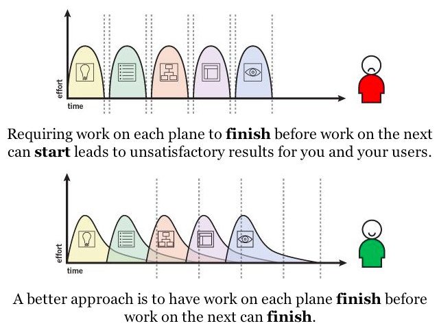
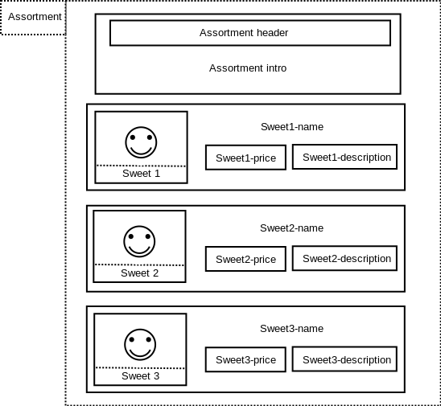
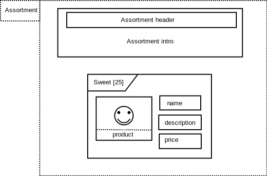

= The Drop Shop: A first static site
:Author: Alex Jongman
The Drop Shop Version 1
:sectnums:
:toc:
:icons: font
ifdef::env-github[]
:tip-caption: :bulb:
:note-caption: :information_source:
:important-caption: :heavy_exclamation_mark:
:caution-caption: :fire:
:warning-caption: :warning:
endif::[]

In this version a very simple first website for the fictional case "The Drop Shop" will be designed.

== The Strategy layer
Because we want to focus this tutorial on U__ia__ML we will not go very deep into how we approached this layer and the deliverables of this layer will be very brief.

=== Business Case
The site to be build should provide some basic information for customers so that visitors of the site know what the shop is about, where to find it and when the shop is open for business. The shop owner also wants to distinguish himself from other sweets shop by showing that this shop really knows it's products.

=== Personas
The typical visitors of the shop and properly visitors of the site can be distinguished between:

* **Ilse**: A child of 11 years old who really likes all kinds of sweets especially when they are colorful.
* **Jaap**: A business man who often travels and always wants to have some 'drop' with him. He always is interested in new kinds of 'drop' and the story behind it.

== The Scope layer
Because the site should be very basic the site will be static and will not provide any interactivity.
Therefore there are no UML Use Cases can be defined.
But from the Business Case we can extract some User Stories:

. As a customer I want to know where the shop is located and how it looks in order to determine if I want to travel to it.
. As a customer I want to know when the shop is open
. As a customer I want to see what kinds of sweets the shop provides.
. As the business owner I want to distinguish the shop from other sweets sellers by showing that the shop really is specialized in sweets and can provide information normally not available at other stores.

== The Structure layer
We will now use the U__ia__ML Sitemap Diagram (SMD) to provide the sitemap deliverable of the structure layer.

We start this process of defining the SMD model by first determine the contentareas we want to use and their documentation.

.The Contentareas

.Contentarea documentation
[%autowidth, options=header]
|===
| Contentarea ID | Description
| Shop-Information | Information about the location of the shop, some inside- and outside images of the store to give an impression of the store and a information about the opening hours.
This contentarea therefore fulfills the requirements of the first and second user story.
| Liquorice-Information | A story combined with some images about the liquorice plant and the history of sweets in general.
This content area will be be the realization of the forth user story.
| Assortment | A static overview of some sweets sold at the store (the third user story).
|===

By also using the extension 'ux-decision' we can determine the content priority for the contentareas.

.Contentarea documentation with ux-decision extension
[%autowidth, cols="3*a", options=header]
|===
| Contentarea ID | Description | ux-extension

| Shop-Information | Information about the location of the shop, some inside- and outside images of the store to give an impression of the store and a information about the opening hours.
This contentarea therefore fulfills the requirements of the first and second user story. | 
[%autowidth, cols=3]
!===
! Ilse
! priority 8
! She knows the store very well, therefore the location is known to her, but often forgets the opening hours of the store.

! Jaap
! priority 9 
! Based on the impressions of the store he determines whether to buy his sweets at the nearest supermarket or at this specialized store. This information about the location and opening hours is very important to him because he travels often by car and has to determine the route to the shop and if he will make it in time after work before the shop closes. 
!===
| Liquorice-Information | A story combined with some images about the liquorice plant and the history of sweets in general. 
This content area will be be the realization of the forth user story. |
[%autowidth, cols=3]
!===
! Ilse
! priority 1 
! For her this information is boring, only the image of the liquorice plant might get her attention.

! Jaap
! priority 5 
! For him this information is nice to know and might be useful in a conversation with foreigners who aren't familiar with this dutch treat. It also gives him some insurance that the store knows its sweets.
!===
| Assortment | A static overview of some sweets sold at the store (the third user story). |
[%autowidth, cols=3]
!===
! Ilse
! priority 8
! She likes to look at the sweats, especially when they are colorful. It gives her ideas of what to buy next.

! Jaap
! priority 6
! It gives him a good impression of what the store has to offer, but he would prefer a more complete overview and online store.
!===
|===

From the table we can conclude that the 'Shop-Information' is most important to our personas followed by the 'Assortment' and that the 'Liquorice-Information' is less important. The 'Shop-Information' therefore should be on the first page the site visitors see.

Determining now our pages we decide to go with 3 pages, one for each of our contentareas and that the startpage should be the page containing the 'Shop-Information'. Which are all part of our 'Drop-Shop' Sitemap.

.First U__ia__ML sitemap

The minimal documentation for this sitemap is given by the following tabel.

.page documentation
[options=header]
|===
| Page ID | Startpage | LandingPage
| Home-page | yes | no
| Product-info-page | no | no
| Assortment-page | no | no
|===

Since this table doesn't add information we already can see in the sitemap image itself we could argue that we can skip this table. But since their is currently no U__ia__ML CASE tool available, and these sitemaps are often drawn by hand, we add the table to make sure that we don't misinterpret a hand drawn sitemap. +
Another advantage of having this table is that we can extend it with for instance the ex-decision extension.

.page documentation with ux-decision extension
[%autowidth, cols="4*a"]
|===
| Page ID 
| Start +
page 
| Landing +
Page 
| ux-decision
| Home-page | yes | no |
[%autowidth, cols="3*"]
!===
! Ilse ! Shop-Information: __medium__ 
! There is only one contentarea on this page.
! Jaap ! Shop-Information: __medium__ 
! There is only one contentarea on this page.
!===

| Product-info-page | no | no |
[%autowidth, cols="3*"]
!===
! Ilse ! Liquorice-Information: __medium__ 
! There is only one contentarea on this page.
! Jaap ! Liquorice-Information: __medium__ 
! There is only one contentarea on this page.
!===

| Assortment-page | no | no |
[%autowidth, cols="3*"]
!===
! Ilse ! Assortment: __medium__ 
! There is only one contentarea on this page.
! Jaap ! Assortment: __medium__ 
! There is only one contentarea on this page.
!===
|===

However, since each page holds exactly one contentarea, their is no relative priority between the contentareas of the pages and therefore this table adds no meaningful information.

If we however would have decided to place the 'Shop-Information' and the 'Assortment' contentareas on the same page the relative priority between them would have mattered and the table then would provide some meaningful information that would be of value on the surface layer. Because a designer could then convert the priority by making the contentarea with the higher relative priority more visible prominent.

So far the sitemap fine, but it doesn't show any navigational links between the pages. This would mean that their is no navigation between them and the pages are only reachable by entering their URL in the browser.
We want to fix this and decide that a visitor should be able to access the Product-info-page as well as the Assortment-page from a link provided by the Shop-information contentarea.

NOTE: A link always starts from within a contentarea and points to page.

.U__ia__ML sitemap with links

Since the links we added are normal links triggered by the visitor of our site, no documentation of the links is required.

It also doesn't matter how many links from the Shop-Information contentarea toward for instance the Assortment-page the actually will be, they all are represented by a single link.

As can be seen from the sitemap the visitor will be able to navigate from the Shop-information contentarea of the default start page, the Home-page toward either the Product-info-page or the Assortment-page.
The Shop-information contentarea drawn within the Home-page therefore has become the contentarea that defines all the links of the Shop-information contentarea, which we indicate by underlining the ID of the contentarea.

We can also see that there are no links defined emitting from the Liquorice-information contentarea as well as from the Assortment contentarea. 
But those are the only occurrences of those contentareas within our sitemap and therefore they are also automatically the contentareas the defines the links they are providing (none), which is why their contentarea ids too are underlined.

This means that a visitor who navigates away from the Home-page has to use the back button of the browser to navigate back to the Home-page. To solve this we could add links to the Assortment and Liquorice-Information contentarea but that is not what we want.
We want to add a menu to the pages in order to enable navigation between the pages.

We now could choose to add a menu to the description of each of the contentareas, but that is not a good choice. The menu is not something we would expect to be part of those contentareas. 

A better way is to add a new contentarea "Menu" that will be present on all pages, and will enable the visitors to navigate to all the pages of our site.

.Menu Contentarea documentation with ux-decision extension
[%autowidth, cols="3*a", options=header]
|===
| Contentarea ID | Description | ux-extension

| Menu | A navigational menu to access all pages of the site  | 
[%autowidth, cols=3]
!===
! Ilse
! priority 4
! The menu doesn't contain the content that she wants to see on the site, but it is a contentarea she expect to be part of the site.

! Jaap
! priority 4 
! The menu doesn't contain the content that he wants to see on the site, but it is a contentarea he expect to be part of the site.
!===
|===

.U__ia__ML the final sitemap
image::./version1-structure4.png[final sitemap]

If you take a closer look at the sitemap you will see that from the three Menu contentarea only one is underlined. As stated earlier, the one underlined defines all the links emitting from that contentarea. Therefore each contentarea of the sitemap has exactly one link defining contentarea. +
The links defined at that contentarea are also available from the contentareas on the other pages. So on the Assortment-page for instance the menu contentarea also has three links going to the Home-page, the Product-info-page and one going to the Assortment-page itself.

One might further notice that the Menu contentarea on the Assortment-page isn't on the top like with the other pages and that the Menu-contentarea is just as big as the other contentarea on the page. This however doesn't matter from a modeling point of view. The Sitemap Diagram (SMD) is no wireframe and but an abstract model of the content, their distribution over the pages and the links between the contentareas and the pages.
A future extension with regard to the layout may address this, but the layout is an aspect we currently don't model with U__ia__ML.

== The Skeleton layer

Now that we know which contentareas there will be, we can define them one by one, with the U__ia__ML Contentarea Diagram (CAD).

NOTE: The CAD is no wireframe but a blueprint meant for designers and developers that we can you to derive a wireframe. It's not a diagram that should be readable for customers.

=== The menu contentarea

To model the Menu contentarea we first need a Contentarea Diagram to hold the content of the menu contentarea.

.The Menu Contentarea construct

Next we will define 3 text labels, one for each link that can be followed from the menu.

.The filled Menu Contentarea

As stated by the specification of the cad-text-label we used, we also have to document these text labels.

.text label documentation
[%autowidth, cols="2*a", options=header]
|===
| Text label | Intended content
| Home | Text label to indicate that by activating this label the user will be navigated to the home page.
| Liquorice Information | Text label to indicate that by activating this label the user will navigate to the Liquorice Information page.
| Assortment | Text label to indicate that by activating this label the user will navigate to the Assortment page.
|===

To express that the labels are clickable and that they indeed activate a navigational link we have to add the links to them. +
The ID's of the links have to match those in the sitemap diagram.

.The Menu Contentarea with links

And since this contentarea will also be present on all pages and a user might experience the menu as part of a site header, we can also include a clickable logo that will also result in a navigation toward the Home-page.

.The final Menu Contentarea
image::./version1-skeleton-menu4.png[The final Menu contentarea]

As with the text label elements the image element also requires documentation.

.image documentation
[%autowidth, cols="2*a", options=header]
|===
| Image ID | Intended content
| Logo | A company logo that by clicking will navigate the user to the home page.
|===

That there are now two links label 'Home', while the sitemap only shows one link has no consequences for either the sitemap diagram (SMD) or this contentarea diagram (CAD).

We could stop here and continue to the next contentarea, but we also have an option to apply the 'content specification extension', which we will do here to give you an impression of this extension.

First we will determine whether the text labels are static or dynamically generated.

.text label documentation with content specification
[%autowidth, cols="3*a", options=header]
|===
| Text label | Intended content | type
| Home | Text label to indicate that by activating this label the user will be navigated to the home page. | static
| Liquorice Information | Text label to indicate that by activating this label the user will navigate to the Liquorice Information page. | static
| Assortment | Text label to indicate that by activating this label the user will navigate to the Assortment page. | static
|===

Next we will give the actual content for each text label for each language our shop site should support. Currently we our site will only support the Dutch language.

.text label documentation, content specification
[%autowidth, options="header"]
|===
| Text label | Language | Content
| Home | NL | "Home"
| Liquorice Information | NL | "Meer over drop"
| Assortment | NL | "Ons assortiment"
|===

Something we could also do for the image element

.image documentation with content specification extension
[%autowidth, cols="4*a", options=header]
|===
| Image ID | Intended content | type | URI
| Logo | A company logo that by clicking will navigate the user to the home page. | static | "D:\images\DropShopLogo.png"
|===

=== The Shop-Information contentarea

Since we have defined the intended content for this contentarea in the structure layer we now have an idea of the elements to be placed within this contentarea.

[quote]
Information about the location of the shop, some inside- and outside images of the store to give an impression of the store and a information about the opening hours.

We also want to welcome the visitors of the site which we combine with the impression images of the shop.
We therefore can distinguish three parts of this contentarea:

. Welcome & Impressions
. Opening hours
. Location information

It depends on whether those three parts should be separately reusable or that the user should experience them as three separate parts of the page.
If this is the case it might be a better choice to go back to the structure aspect of the site and model them as three separate contentareas. 

According to the book link:http://www.jjg.net/elements/["The Elements of User Experience" by Jesse James Garrett], this would also be the better choice.

However because in this particular case (its a tutorial were the author knows what lies ahead) the effect would be negligible and therefore we will go on an model them on a single contentarea, the Shop-Information contentarea, but in a real project we would strongly advise to take back a step and split up the Shop-Information Contentarea into three smaller contententareas.

We start with the Welcome & Impression part, which we could model as a text label of which its container contains two images in order to express the grouping of this information.

.The Shop-Information Contentarea

To emphasize that the welcome text also needs a header we add an additional text label within the 'Welcome text' text label.

.The Shop-Information Contentarea

And since we can see in the sitemap that this contentarea should contain links toward the Liquorice information page and the Assortment page, which would make no sense at the Opening hours and / or Location part of this contentarea we add those links as well.

WARNING: But now we have a problem that we must deterministic determine from where those links are triggered. We therefore can not assign both links to a single content area element (CAE).

.The Shop-Information Contentarea

However because the 'Welcome header' and the images are within the text label of the welcome text, they will inherit the link provided by the Welcome text element if not overwritten as it is the case with the Inside Impression image element.
Again this isn't wat we wanted because a user might get confused that when he accidentally click on the welcome header get forwarded toward the Liquorice Information page.

To solve this we add additional text labels within the Welcome text that hold the links.

.The Shop-Information Contentarea

We can finish the page by adding the elements for the Opening hours and Location information.

.The Shop-Information Contentarea
image::./version1-skeleton-shop5.png[The Shop-Information contentarea]

NOTE: As with the Sitemap Diagram, the layout doesn't matter. A future extension with regard to the layout may address this, but currently the layout is an aspect we don't model with U__ia__ML. The grouping however gives some visual layout guidelines, which for instance would be a layout violation if we would place the Outside Impression Image as part of the Location Information.

The last part we have to take care of before we can finish this contentarea is the documentation part of the elements.

.image documentation
[%autowidth, cols="2*a", options=header]
|===
| Image ID | Intended content 
| Outside Impression | An image that shows the shop from the outside, so that visitors can easily recognize the shop.
| Inside Impression | An image of the inside of the shop to give the impression that it's a nice clean shop, where the stocks are filled and their is plenty of sweets to choose from.
| Street Map | A simple street map that has a marker that shows the location of the shop.
|===

.text label documentation
[%autowidth, cols="2*a", options=header]
|===
| Text label | Intended content 
| Welcome header | A welcome slogan 
| Welcome text | A very short text about the shop that explains what this site is about, what the user can find here and why the user should shop here and not somewhere else.
| Liquorice information | part of the welcome text element that links to the Liquorice-Information-page.
| Assortment | part of the welcome text element that links to the Assortment-page.
| Opening hours | A table with the opening hours of the shop.
| Location information | The address of the shop as well as information about the nearest public transport stop and about parking.
|===

In case we would now also apply the content specification extension, we will encounter a problem when we specify the static content of the 'Welcome text'. This is because this text will have to contain the content specification of the 'Assortment' and 'Liquorice information' elements and it might be unclear where in the 'Welcome text' this content has to be applied. +
To solve this issue we can make use of interpolation symbols '{{ }}' as they are also frequently used by several front-end frameworks, which refers to the CAE element to be substituted.
An extract from content of the 'Welcome text' then would look like:

.text label documentation, content specification
[%autowidth, options="header"]
|===
| Text label | Language | Content
| Assortment | NL | "aanbod van snoepgoed"
| Liquorice Information | NL | "hier"
| Welcome text | NL | "... in onze winkel vind je een ruim {{ Assortment }}, waaronder ook snoepgoed dat we in eigen productie toebereiden, waarover je {{ Liquorice Information }} meer informatie kunt vinden. ..."
|===

=== The Liquorice-Information contentarea

The contentarea description in the structure layer of the Liquorice-Information contentarea states:

[quote]
A story combined with some images about the liquorice plant and the history of sweets in general. This content area will be be the realization of the forth user story.

Given the previous two contentareas the Liquorice-Information contentarea holds no new rocket science. And therefore the result is quickly derived.

.The Liquorice-Information Contentarea
image::./version1-skeleton-liquorice1.png[The Liquorice-Information contentarea]

.text label documentation
[%autowidth, cols="2*a", options=header]
|===
| Text label | Intended content 
| Liquorice story header | A short header of the liquorice story
| Liquorice story | A story about liquorice, which should contain a little bit about the history of sweets, the liquorice plant itself, the production of sweets and the current state of sweets in general.
|===

If we take a closer look at the Intended content of the Liquorice story, we can make the argument that the it might be better to split up the text label into several smaller text labels.
The argumentation of this decision is valid, but this is a typical example of where we also could go on and might redetermine this decision once the actual content is available.

.image documentation
[%autowidth, cols="2*a", options=header]
|===
| Image ID | Intended content 
| Liquorice plant | An image that combines a drawing and photo of the liquorice plant.
| Sweets production | A photo of the sweets production, preferable in a kitchen setting to show the handmade products that this shop also offers.
| Sweets | The handmade final product.
|===

=== The Assortment contentarea
The Assortment contentarea should provide a static overview of some of the sweats sold at the store.
We could approach the design of this contentarea as we did with the other contentareas by defining a couple of images and text labels to fill this area, resulting in a CAD that might look like this one.

.The Assortment Contentarea

What we can see in this CAD is that we have drawn three sweets, because the number of sweets that should be shown on this part of the page hasn't been determined yet, a number we have to are quickly on with the product owner, because as we stated in the beginning, this version of the site will be that of a static site.
So imagine that we agree on 25 sweets, we could replicate 25 of the sweet-name text labels including the elements it contains and add them to the CAD. The result would be a dull model.

But what we can see is that we have a repartition, a list of elements.
This is something U__ia__ML can model as well.

.The Assortment Contentarea

The first part of this contentarea is nothing new, only to text labels.

.text label documentation
[%autowidth, cols="2*a", options=header]
|===
| Text label | Intended content 
| Assortment header | A short header that express what this contentarea is about.
| Assortment intro | a short introduction to this contentarea, so that the visitors know that this is area shows only a selection of the products and that you have to come to the store to buy them.
|===

But then we see a new symbol, the cae-list element with the ID 'Sweet'.
The [25] behind the ID indicates that this is a list that holds 25 items, which makes sense since that this site is a static site.
Within the container of the list element we see text label elements and an image element. 
So we could think that the documentation part of those elements contained within the list would be:

.text label documentation
[%autowidth, cols="2*a", options=header]
|===
| Text label | Intended content 
| name | Name of the sweet
| description | A short description of the sweet
| price | the price of the sweet incl vat.
|===

.image documentation
[%autowidth, cols="2*a", options=header]
|===
| Image ID | Intended content 
| product | a photo of the sweet.
|===

But now we will get into problems when we want to refer to a specific sweet, for instance because we want to specify the content for that sweet. This problem can be solved by using the U__ia__ML path together with the ID.

.text label documentation
[%autowidth, cols="2*a", options=header]
|===
| Text label | Intended content 
| sweet[n].name | Name of the sweet
| sweet[n].description | A short description of the sweet
| sweet[n].price | the price of the sweet incl vat.
|===

.image documentation
[%autowidth, cols="2*a", options=header]
|===
| Image ID | Intended content 
| sweet[n].product | a photo of the sweet.
|===

Where the index 'n' can be replaced by an actual number to point to a specific item within the list.

NOTE: Actually the U__ia__ML path given is a referential path, from the current contentarea diagram. To express the full path the U__ia__ML path would be preceded by the contentarea id.

The only element left on the contentarea that still needs to be documented is the list element.

.List documentation
[%autowidth, cols="4*a", options=header]
|===
| List ID | Sort Element | Sort Order | Recursion
| Sweet | Name | Alphabetically - Ascending | no
|===

This documentation of the list element tells us that the items in the list will have an initial sort order. They will be ordered alphabetically based on the value of the 'name' element.

There is also an attribute that this list is not recursive. Recursive lists are lists that contain clickable items that results in a new list of the same structure, as it is for instance the case with the lists in your file explorer (that list contains folders and files, and when you select a folder you enter a recursive step that results again in a list of files and folders).

== The Surface layer

Now that all contentarea have been modelled, we can continue toward the the final plane, the surface layer.

The lower layers have determined a lot of choices, which reduces the choices a designer / developer can make in this final layer, which is a good thing.

.Elements of User Experience ( link:https://ux.stackexchange.com/questions/51195/font-size-or-layout-which-to-decide-first[] )
image::x7VC7.jpg[]

The surface layer however is not a part that is covered by U__ia__ML, and which will conclude this tutorial of the first version of the Drop Shop.

== Appendix - Deliverables
Since this is a tutorial that contains many images and tables you might wonder what remains if you would write a design document.
In this chapter only the parts from this tutorial that would go into such a design document are extracted.

=== Strategy Layer

==== Business Case
The site to be build should provide some basic information for customers so that visitors of the site know what the shop is about, where to find it and when the shop is open for business. The shop owner also wants to distinguish himself from other sweets shop by showing that this shop really knows it's products.

==== Personas

* **Ilse**: A child of 11 years old who really likes all kinds of sweets especially when they are colorful.
* **Jaap**: A business man who often travels and always wants to have some 'drop' with him. He always is interested in new kinds of 'drop' and the story behind it.

=== Scope Layer

==== User Stories

. As a customer I want to know where the shop is located and how it looks in order to determine if I want to travel to it.
. As a customer I want to know when the shop is open
. As a customer I want to see what kinds of sweets the shop provides.
. As the business owner I want to distinguish the shop from other sweets sellers by showing that the shop really is specialized in sweets and can provide information normally not available at other stores.

==== UML Use Cases
there are no UML Use Cases

=== The Structure layer

.The U__ia__ML Sitemap
image::./version1-structure4.png[The U__ia__ML sitemap]

.Contentarea documentation with ux-decision extension
[%autowidth, cols="3*a", options=header]
|===
| Contentarea ID | Description | ux-extension

| Menu | A navigational menu to access all pages of the site  | 
[%autowidth, cols=3]
!===
! Ilse
! priority 4
! The menu doesn't contain the content that she wants to see on the site, but it is a contentarea she expect to be part of the site.

! Jaap
! priority 4 
! The menu doesn't contain the content that he wants to see on the site, but it is a contentarea he expect to be part of the site.
!===

| Shop-Information | Information about the location of the shop, some inside- and outside images of the store to give an impression of the store and a information about the opening hours.
This contentarea therefore fulfills the requirements of the first and second user story. | 
[%autowidth, cols=3]
!===
! Ilse
! priority 8
! She knows the store very well, therefore the location is known to her, but often forgets the opening hours of the store.

! Jaap
! priority 9 
! Based on the impressions of the store he determines whether to buy his sweets at the nearest supermarket or at this specialized store. This information about the location and opening hours is very important to him because he travels often by car and has to determine the route to the shop and if he will make it in time after work before the shop closes. 
!===
| Liquorice-Information | A story combined with some images about the liquorice plant and the history of sweets in general. 
This content area will be be the realization of the forth user story. |
[%autowidth, cols=3]
!===
! Ilse
! priority 1 
! For her this information is boring, only the image of the liquorice plant might get her attention.

! Jaap
! priority 5 
! For him this information is nice to know and might be useful in a conversation with foreigners who aren't familiar with this dutch treat. It also gives him some insurance that the store knows its sweets.
!===
| Assortment | A static overview of some sweets sold at the store (the third user story). |
[%autowidth, cols=3]
!===
! Ilse
! priority 8
! She likes to look at the sweats, especially when they are colorful. It gives her ideas of what to buy next.

! Jaap
! priority 6
! It gives him a good impression of what the store has to offer, but he would prefer a more complete overview and online store.
!===
|===

.page documentation
[options=header]
|===
| Page ID | Startpage | LandingPage
| Home-page | yes | no
| Product-info-page | no | no
| Assortment-page | no | no
|===

=== The Skeleton Layer

==== Menu contentarea

.The Menu Contentarea
image::./version1-skeleton-menu4.png[The final Menu contentarea]

.image documentation with content specification extension
[%autowidth, cols="4*a", options=header]
|===
| Image ID | Intended content | type | URI
| Logo | A company logo that by clicking will navigate the user to the home page. | static | "D:\images\DropShopLogo.png"
|===

.text label documentation
[%autowidth, cols="3*a", options=header]
|===
| Text label | Intended content | type
| Home | Text label to indicate that by activating this label the user will be navigated to the home page. | static
| Liquorice Information | Text label to indicate that by activating this label the user will navigate to the Liquorice Information page. | static
| Assortment | Text label to indicate that by activating this label the user will navigate to the Assortment page. | static
|===

.text label documentation, content specification
[%autowidth, options="header"]
|===
| Text label | Language | Content
| Home | NL | "Home"
| Liquorice Information | NL | "Meer over drop"
| Assortment | NL | "Ons assortiment"
|===

==== Shop-Inforamtion Contentarea

.The Shop-Information Contentarea
image::./version1-skeleton-shop5.png[The Shop-Information contentarea]

.image documentation
[%autowidth, cols="2*a", options=header]
|===
| Image ID | Intended content 
| Outside Impression | An image that shows the shop from the outside, so that visitors can easily recognize the shop.
| Inside Impression | An image of the inside of the shop to give the impression that it's a nice clean shop, where the stocks are filled and their is plenty of sweets to choose from.
| Street Map | A simple street map that has a marker that shows the location of the shop.
|===

.text label documentation
[%autowidth, cols="3*a", options=header]
|===
| Text label | Intended content | type
| Welcome header | A welcome slogan 
| Welcome text | A very short text about the shop that explains what this site is about, what the user can find here and why the user should shop here and not somewhere else.
| Liquorice information | part of the welcome text element that links to the Liquorice-Information-page.
| Assortment | part of the welcome text element that links to the Assortment-page.
| Opening hours | A table with the opening hours of the shop.
| Location information | The address of the shop as well as information about the nearest public transport stop and about parking.
|===

==== Liquorice-Information Contentarea

.The Liquorice-Information Contentarea
image::./version1-skeleton-liquorice1.png[The Liquorice-Information contentarea]

.text label documentation
[%autowidth, cols="2*a", options=header]
|===
| Text label | Intended content 
| Liquorice story header | A short header of the liquorice story
| Liquorice story | A story about liquorice, which should contain a little bit about the history of sweets, the liquorice plant itself, the production of sweets and the current state of sweets in general.
|===

.image documentation
[%autowidth, cols="2*a", options=header]
|===
| Image ID | Intended content 
| Liquorice plant | An image that combines a drawing and photo of the liquorice plant.
| Sweets production | A photo of the sweets production, preferable in a kitchen setting to show the handmade products that this shop also offers.
| Sweets | The handmade final product.
|===

==== Assortment Contentarea

.The Assortment Contentarea

.List documentation
[%autowidth, cols="4*a", options=header]
|===
| List ID | Sort Element | Sort Order | Recursion
| Sweet | Name | Alphabetically - Ascending | no
|===

.text label documentation
[%autowidth, cols="2*a", options=header]
|===
| Text label | Intended content 
| Assortment header | A short header that express what this contentarea is about.
| Assortment intro | a short introduction to this contentarea, so that the visitors know that this is area shows only a selection of the products and that you have to come to the store to buy them.
| sweet[n].name | Name of the sweet
| sweet[n].description | A short description of the sweet
| sweet[n].price | the price of the sweet incl vat.
|===

.image documentation
[%autowidth, cols="2*a", options=header]
|===
| Image ID | Intended content 
| sweet[n].product | a photo of the sweet.
|===

=== The Surface Layer

This would be the final product, which is out of scope for this tutorial